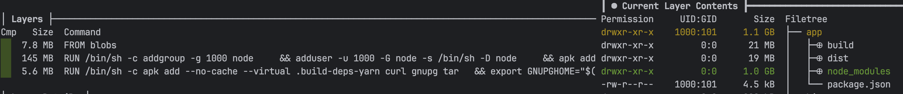
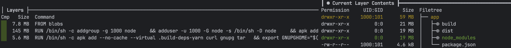
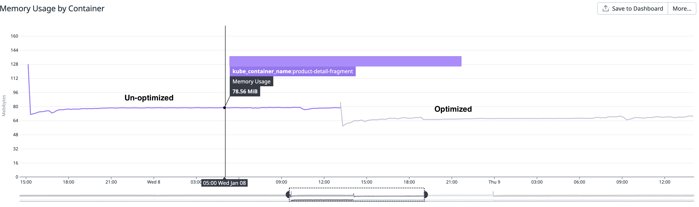

# prunify-modules

like npm `prune --production` just better

`prunify-modules` is a lightweight Node.js tool that helps you efficiently prune unnecessary dependencies from your node_modules folder, tailored to your production environment’s needs.

## Considering a Dockerfile...

with the setup of multi-stage builds for a moderate sized (un-optimized) application - with about 50 prod dependencies:

````Dockerfile
# Base stage
FROM node:22-alpine AS base

# Install dependencies stage
FROM base AS build

COPY package.json package-lock.json ./

RUN npm ci --production=false && rm -f .npmrc

COPY --chown=hive:hive src/ src/

ARG NODE_ENV="production"
ENV NODE_ENV="${NODE_ENV}"

RUN NODE_ENV=${NODE_ENV} \
    npm run build

RUN if [ "${NODE_ENV}" = "production" ]; \
    then npm prune --production;  \
    fi

FROM base

COPY --from=build /app/dist /app/dist
COPY --from=build /app/package.json /app/package.json
COPY --from=build /app/node_modules /app/node_modules

CMD ["node", "/build/server/index.js"]
````

Because of the node_modules folder that gets copied to the last stage the docker image size is:

| REPOSITORY          | TAG    | IMAGE ID | CREATED        | SIZE   |
|---------------------|--------|----------|----------------|--------|
| app-unoptimized     | latest | xxx      | xx seconds ago | 1.25GB |

Doing a deeper analysis with dive - a Docker image analysis tool it is visible which part of the app is responsible for its size:



## On the contrary...

Applying a small change to the Dockerfile:

````Dockerfile
RUN if [ "${NODE_ENV}" = "production" ]; \
    prunify-modules --externals @datadog,react,react-dom,react-intl,@sentry/browser,@sentry/core --prune typescript,babel,react-native,@types,eslint \
    fi
````

can make a significant impact on the image size:


| REPOSITORY        | TAG    | IMAGE ID | CREATED        | SIZE    |
|-------------------|--------|----------|----------------|---------|
| app-optimized     | latest | xxx      | xx seconds ago | 230MB   |

which is even in the analysis of the image visible:




Since now we clarified the impact of change...

## So why using prunify-modules?

* Considering docker best practices it is typically recommended to use slimmer docker images that are dedicated for running the application, in order to also reduce the attack surface of an container: [Docker recommendations](https://docs.docker.com/build/building/best-practices/#:~:text=You%20should%20also,the%20attack%20surface.)
* When using a service for storing your Docker images you might be billed by GB storage usage: Like AWS ECR. It is possible to significantly reduce the storage costs
* The utilized startup resources (on request resources) for an application-container on Kubernetes is significantly lower compared to an un-optimized container. Furthermore, also the avg resource utilization can be around 16% less (in our example)
  

## Usage

The prunify-modules CLI offers some options to customize how dependencies are pruned from your node_modules directory. Here’s an overview of the available options:

Keep in mind that when using bundlers to package imported third-party code, it may sometimes be necessary to externalize certain dependencies, such as native C++ modules, as they cannot be processed by the bundler. In such cases, externalizing these dependencies becomes essential.

### Options

| **Option**           | **Alias**  | **Description**                                                                                                                    | **Default Value** |
|-----------------------|-------------|------------------------------------------------------------------------------------------------------------------------------------|-------------------|
| `--dry-run`           | `-d`        | Lists dependencies that would be pruned without actually deleting them. Use this to preview the impact of pruning.                 | `false`           |
| `--externals <list>`  | `-e`        | A comma-separated list of dependencies to exclude from pruning. Transitive dependencies of these externals will also be retained.  | `[]`              |
| `--prune <list>`      | `-p`        | A comma-separated list of dependencies to explicitly prune, even if they are marked as production dependencies.                    | `[]`              |


### Basic Usage

```bash
prunify-modules --externals react,react-dom,@sentry/browser
```

Expected output:

```
node_modules size un-optimized being:  xxx MB  
Pruning node_modules  
Pruning complete  
node_modules size optimized being: xxx MB 🚀
```

Explicitly remove certain dependencies even if they are marked as production dependencies:

```bash
prunify-modules --prune typescript,@types,babel
```

Explanation:
-	Dependencies typescript, @types, and babel will be forcibly removed, even if they are present as production dependencies.

### Full Combined Example

Exclude specific dependencies while also forcing others to be pruned:

```bash
prunify-modules --externals react,react-dom --prune typescript,eslint
```

Explanation:
-	The external dependencies react and react-dom (and their transitive dependencies) will not be pruned.
-	The dependencies typescript and eslint will be explicitly removed.


